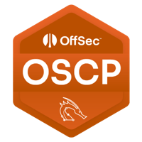
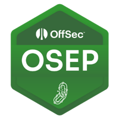
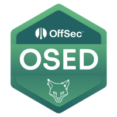
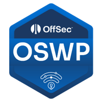
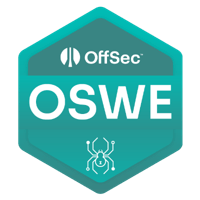
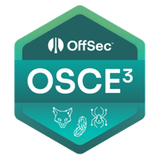
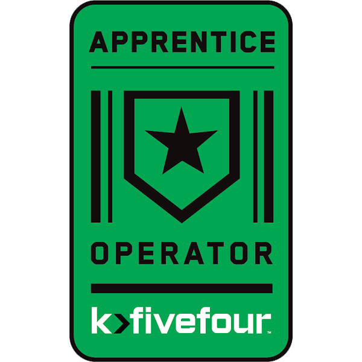

### About Me

- Professional shitposter with the buff™️
- Currently working on my KLCP so I can be a real hacker someday :<

### Certificates

- [credential.net](https://www.credential.net/profile/nukingdragons/wallet)
- [credly.com](https://www.credly.com/users/sabrina-andersen/badges)

<table>
  <tr>
    <th>Abbreviated</th>
    <th>Full Name</th>
    <th>Obtained</th>
    <th>Link</th>
  </tr>
  <tr>
    <td>OSCP </td>
	<td>Offensive Security Certified Professional</td>
    <td>November 3rd, 2022</td>
    <td><a href="https://www.credential.net/1717edba-65ec-4c1a-b74c-827cf3758cf5">Link</a></td>
  </tr>
  <tr>
    <td>OSEP </td>
	<td>Offensive Security Experienced Penetration Tester</td>
    <td>March 28th, 2023</td>
    <td><a href="https://www.credential.net/f84d3215-ee22-4696-84db-3e65938b910c">Link</a></td>
  </tr>
  <tr>
    <td>OSED </td>
	<td>Offensive Security Exploit Developer</td>
    <td>April 5th, 2023</td>
    <td><a href="https://www.credential.net/ab8fcd09-7a09-4c14-a6b0-ab678d5cdb43">Link</a></td>
  </tr>
  <tr>
    <td>OSWP </td>
	<td>Offensive Security Wireless Professional</td>
    <td>April 28th, 2023</td>
    <td><a href="https://www.credential.net/fec7bb38-2389-4083-a0fd-c43ae1fc3aad">Link</a></td>
  </tr>
  <tr>
    <td>OSWA </td>
	<td>Offensive Security Web Assessor</td>
    <td>July 24th, 2023</td>
    <td><a href="https://www.credential.net/387e295a-9d0e-40c4-9f1e-53f8b718c638">Link</a></td>
  </tr>
  <tr>
    <td>OSWE </td>
	<td>Offensive Security Web Expert</td>
    <td>September 5th, 2023</td>
    <td><a href="https://www.credential.net/287b37f8-0b1d-4fbd-abb3-d4f254fbd960">Link</a></td>
  </tr>
  <tr>
    <td>OSCE3 </td>
	<td>Offensive Security Certified Expert 3</td>
    <td>September 9th, 2023</td>
    <td><a href="https://www.credential.net/6756d2f2-a1d2-4d2c-83f8-7cc842d39a69">Link</a></td>
  </tr>
  <tr>
    <td>OSMR </td>
	<td>Offensive Security macOS Researcher</td>
    <td>November 21st, 2023</td>
    <td><a href="https://www.credential.net/356debe9-7c19-41b1-a2e6-fa20da961e6d#gs.0tqj6i">Link</a></td>
  </tr>
  <tr>
    <td>RTAC </td>
	<td>k>fivefour Red Team Apprentice Certified</td>
    <td>March 23rd, 2024</td>
    <td><a href="https://www.credly.com/badges/d8d7bc32-4d47-4f77-a02b-b0012b9decc6/public_url">Link</a></td>
  </tr>
  <tr>
    <td>KLCP</td>
    <td>Kali Linux Certified Professional </td>
    <td>Maybe someday 😭</td>
    <td></td>
  </tr>
</table>
